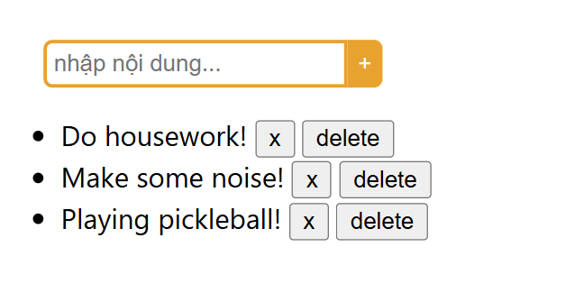

# To-do List React web app

- This is a simple React web app, where I practice Redux
- This web app shows Task to do 
- This web app also have some basic CRUD features: 
  + Add new task
  + Delete task
  + Toggle task to finished

## User Interface (UI)

## Getting starterd
After clone this repository, you can start this project by following steps:
1. Install dependencies:
  + `cd todo-list` (if you’re not in the project directory)
  + `npm install`
2. Run this React project (at another new terminal):
  + `cd todo-list` (if you’re not in the project directory)
  + `npm start`

